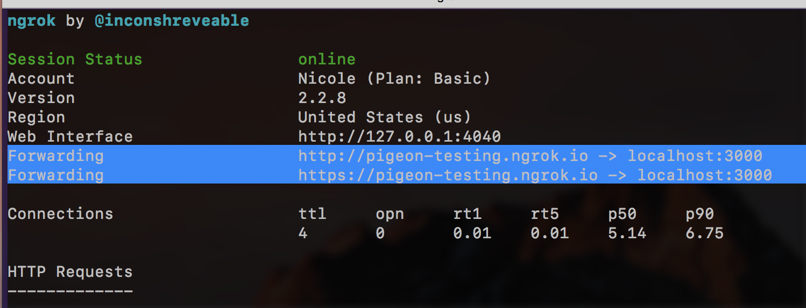
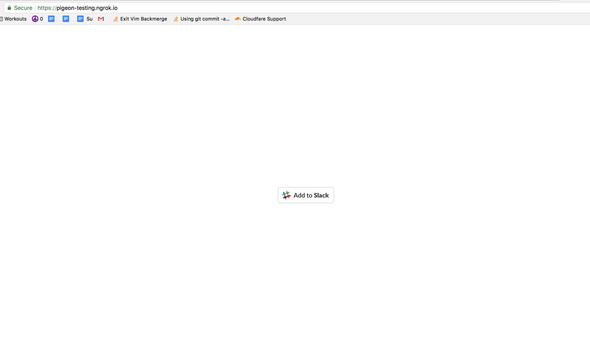
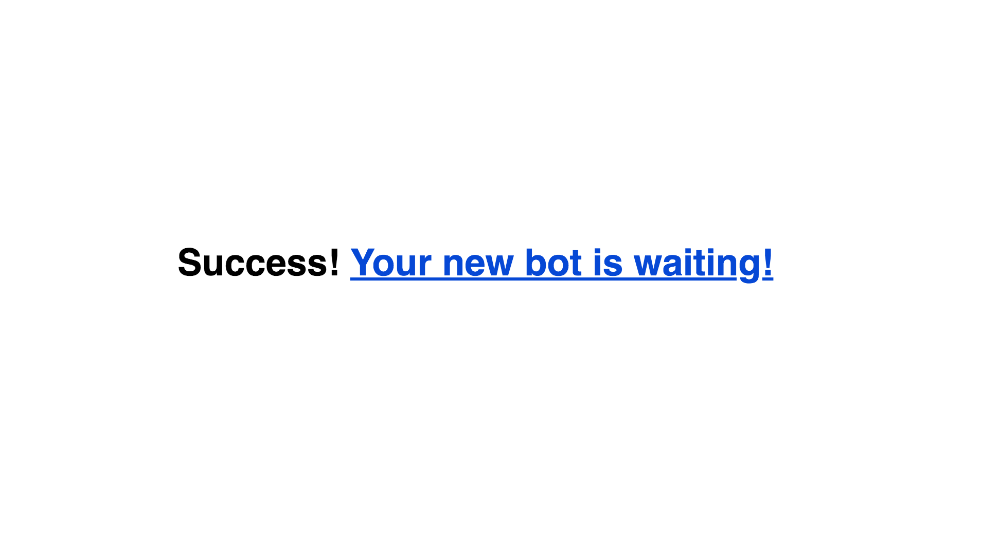

# Pigeon
Insert test build badge here. (Will be addressed in this task - https://trello.com/c/yptFCLY3)

## How it Works
Pigeon is a case management Slack app that allows volunteers to manage a text/chat hotline. Clients text a hotline number, Pigeon opens up a case and a conversation with the client via a chat channel.

Try it out by joining our [sandbox pigeon slack here](https://join.slack.com/t/ddf-hotline-sandbox/shared_invite/enQtNDM3ODQzNTY5Mzk1LTc5ZDA1MmI5N2E3MDdmMWJkZWQ2NDJiMTVmOWM3ZDBkYmI1OTBlZTJiMjRhYTg1ODg0ZDk2NjAwZjhmMTQxN2I). The hotline number you can text is pinned to the #general channel and is also in subject line of the slack.

### Tech
* Twilio > Smooch > Slack integration opening up a two way conversation between a client and a volunteer
  * Here's an [implementation guide for setting up those integrations](https://docs.google.com/presentation/d/e/2PACX-1vQ_aW1YF75JLHjFQUJ_NHANT37NyNmeywmbNjeHH7ap1LTYL1dHA_vtYIVyRCmbygFf-okZzyvsjEAs/pub?start=false&loop=false&delayms=3000)
* Custom slackbot built off the [Botkit Starter Slack](https://github.com/howdyai/botkit-starter-slack)
  * Our custom Slack commands are in skills/slash_commands.js at the bottom of that file.

### For users
* Each text conversation opens up a new slack channel
* In Slack, a set of custom slash commands support case management functionality, including...
  * `/hello` - checks that Pigeon's properly installed
  * `/cases` - lists all the current cases
  * `/cases_pretty` - lists cases, but prettier
  * `/nextcase` - grabs the next unassigned case
  * `/assign` - assigns a case to a user
  * `/flag` - flags a case any label you write, "needs attention" is the default
  * `/unflag` - unflags a case
  * `/getflags` - returns a list of all flags
  * `/success` - closes a case
  * `/logout` - unassigns all cases for that user (ends their volunteer shift)

## How to Develop Locally

In order to develop locally without creating a Slack app from scratch, you'll need to request access for a few things:
* Access to jdp-hotline-test.slack.com
* Access to jdp-wilson-test app
* Ngrok account (for using a subdomain locally)
Please request access to these items by opening an issue and tagging @DDF-dev.

In order to develop locally, you'll need to run a local instance of the app and use ngrok to point a public URL to your local port. The jdp-hotline-test slack is set up to point to the ngrok generated URL. Below are steps to get started:

Clone the app and install dependencies with npm
```
git clone git@github.com:CyberSecurityFund/slack-hotline.git
cd slack-hotline
npm install
```

Copy the sample .env file into your own .env
```
cp .env.example .env`
```
Then, enter the client id, secret, and verificationToken from the (all from the Basic information in the test Slack).

Boot up the app!
```
npm run start
```

Now, we need to be able to hit our local app from Slack commands. This requires us to have a public url rather than localhost. Enter Ngrok.

To get set up with ngrok, follow the instructions in this tutorial.
https://api.slack.com/tutorials/tunneling-with-ngrok

Use the subdomain pigeon-testing when running ngrok to get the domain that the Slack app is configured to point to.
```
ngrok http -subdomain=pigeon-testing 3000
```
Note -- in order to have access to this domain, you will need to be added to our ngrok account. Please open an issue and tag @DDF-dev to request access :)

Your ngrok output should be something like...


Now go to the URL generated by ngrok. You should see an Add to Slack button. Click that button.



Click that button to authorize this app in the jdp-hotline-test app. You should get a success message like...



And your Slack #general channel should have a notification that you've just added that app as an integration.

Now try to call the `/hello` and `/cases` commands to ensure that all is well.

** Note -- if `/cases` is mysteriously erroring out, try deleting the contents of `/.data`. If you encounter this issue and are able to deterministly reproduce, please let us know (related to https://trello.com/c/ELdp5RGY)

## Staging App / Sandbox environment

* Pigeon app is deployed to https://staging-pigeon.herokuapp.com/
* Slack app is pigeon

## Slack App configuration
If you ever need to configure the Slack app side of things to update what URL the app points at, visit [Slack bot config](https://api.slack.com/apps) to update the URL in the following places...

* Oauth & Permissions > Redirect URLs section
  * Add the ngrok url PLUS "/oauth"
  * Click "Save URLs"
  * Then go to your ngrok url's homepage and click the 'connect to slack button'
  NOTE: this is for adding a TEAM to your bot -- slack doesn't actually need this step (at least in dev)

* Event Subscriptions > Enable Events
  * Update the Request URL
  * URL should be the ngrok base PLUS "slack/receive"
  * Save Changes!

* Slash commands
  * add the list of all the commands listed at the bottom of `./skills/slash_commands.js`
  * make the 'request url' your ngrok base url PLUS "/slack/receive"
  * CHECK the box 'escape users and channels in your app'

## Questions? Comments?
Contact us by opening an issue! Alternatively, send us an email at pigeon@digitaldefensefund.org

